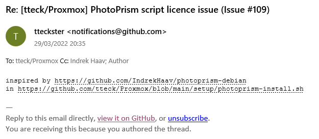
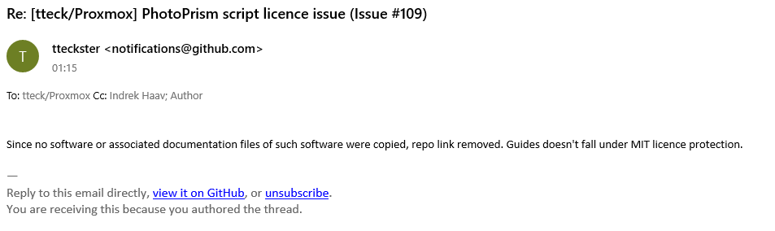

## Example of plagiarism

As of the publishing of this document (30.03.2022), [a PhotoPrism install script](https://github.com/tteck/Proxmox/blob/d72e734dad2a2bcb7c7a80c339a907f3ca9e7f2e/setup/photoprism-install.sh) (in [tteck/Proxmox](https://github.com/tteck/Proxmox)) is based heavily on the guide in this repository, with most of the non-boilerplate parts (including .env and service file contents) copied almost verbatim. However, no attribution or copyright notice is present, despite requests.

- A Github issue was created to request attribution: https://github.com/tteck/Proxmox/issues/109 (now deleted)

- Author of the script initially agreed to add attribution (screenshot of Github notification email):
  
  
- Attribution was added in commit https://github.com/tteck/Proxmox/commit/380e387

- Shortly afterwards, author of the script changed their mind (screenshot of Github notification email):
  
  
- Attribution was removed in commit https://github.com/tteck/Proxmox/commit/d72e734

- Also, the Github issue about this was deleted

- A new issue was created, to respond to the last comment: https://github.com/tteck/Proxmox/issues/112

- The new issue was almost immediately deleted, but not before being archived: https://web.archive.org/web/20220330115410/https://github.com/tteck/Proxmox/issues/112#start-of-content

- A Github discussion was started, to ask about why the issues are getting deleted: https://github.com/tteck/Proxmox/discussions/113

- The discussion was also immediately deleted, but not before being archived: https://web.archive.org/web/20220330120625/https://github.com/tteck/Proxmox/discussions/113#start-of-content

No further attempts were made to reason with the author of the script.
